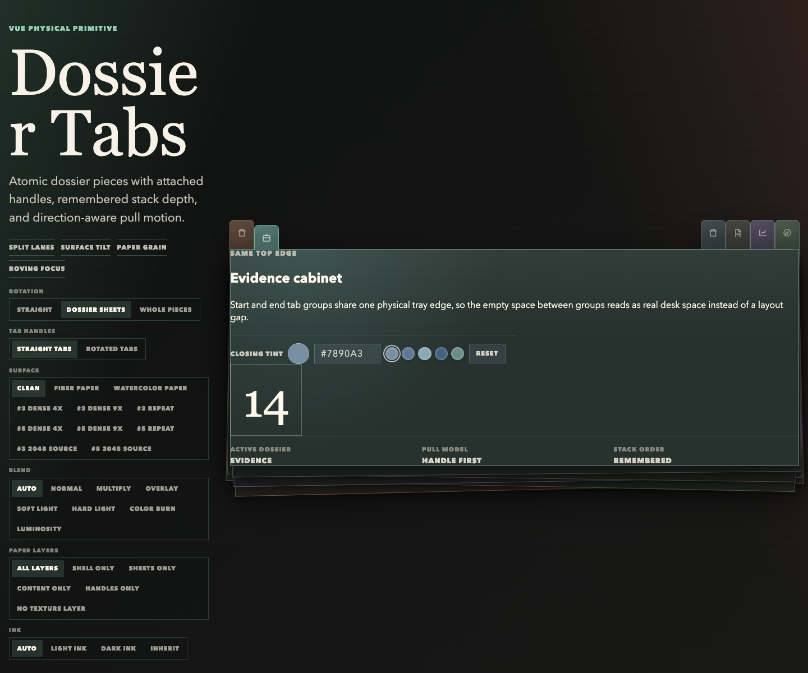
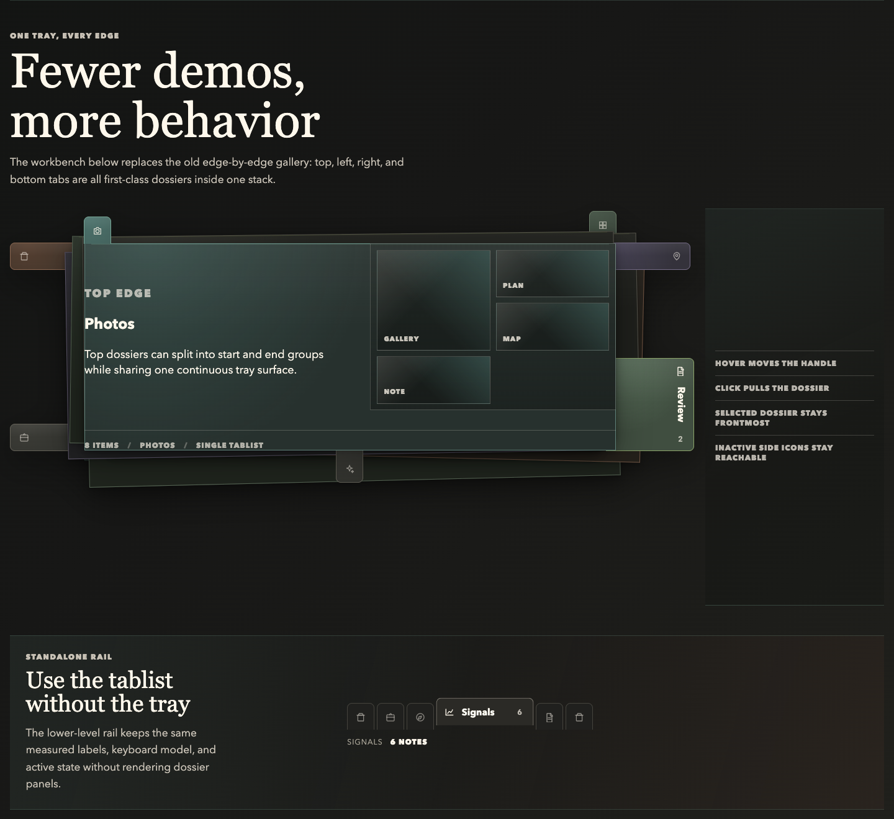
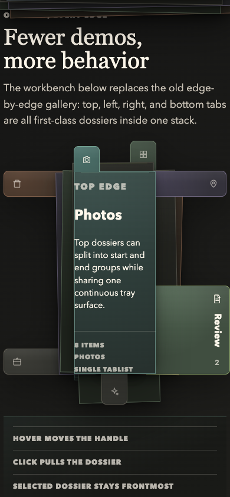

# Dossier Tabs

Tactile dossier/index tabs for Vue. Dossier Tabs turns ordinary tablists into a
physical stack: icon-only at rest, label expansion on the active tab or
interaction, orientation-aware label rotation, optional overlap, and accessible
keyboard navigation.






This project started as a production component in Hammergebot, then became a
generic Vue primitive that can be installed as a package or copied into an app
in the spirit of shadcn-vue.

## Why This Exists

Most tab components are abstract strips. Dossier Tabs is meant for interfaces
where sections should feel like physical dividers: media galleries, document
review, research dossiers, audits, dashboards, notebooks, and anything that
benefits from a compact but memorable navigation object.

## Features

- Vue 3 component with `v-model`.
- Horizontal and vertical orientation.
- Edge-aware behavior: `top`, `bottom`, `left`, or `right`.
- Icon-only resting state with active, hover, or focus expansion.
- Density modes for physical overlap: `spread`, `overlap`, `dense`.
- Stack appearance for vertical, physical dossier-divider layouts.
- `DossierStack` composition where every dossier owns its tab handle and content surface as one physical piece.
- Tintable `DossierFile` surfaces, optional paper texture, and configurable `DossierTray` depth/layers.
- Gravity classes for vertical expansion origin: `start`, `center`, `end`.
- Roving tab focus with automatic or manual activation.
- Full accessible labels can differ from compact visible labels.
- CSS variables for theming.
- No runtime dependencies beyond Vue.

## Install

The package is designed for npm publishing, but early adopters can copy the
source or install from GitHub once the repository is public.

```bash
pnpm add github:bdteo/dossier-tabs
```

```ts
import { DossierIndex } from '@bdteo/dossier-tabs';
import '@bdteo/dossier-tabs/style.css';
```

Bundler-first apps can also import the source barrel when they want to own or
debug the Vue/CSS source directly. The source barrel imports the colocated CSS
file, so do not also import `@bdteo/dossier-tabs/style.css` on this path. Its
published TypeScript surface still points at the generated package
declarations, so component prop types match the normal package entry:

```ts
import { DossierStack } from '@bdteo/dossier-tabs/source';
```

## Copy-In Usage

For shadcn-style ownership, copy these files into your project:

```text
src/components/dossier-tabs/DossierIndex.vue
src/components/dossier-tabs/DossierFile.vue
src/components/dossier-tabs/DossierStack.vue
src/components/dossier-tabs/DossierTray.vue
src/components/dossier-tabs/DossierFileStack.vue
src/components/dossier-tabs/css.d.ts
src/components/dossier-tabs/dossierGeometry.ts
src/components/dossier-tabs/dossierTabs.ts
src/components/dossier-tabs/dossier-tabs.css
src/components/dossier-tabs/index.ts
src/components/dossier-tabs/useDossierPullMachine.ts
src/components/dossier-tabs/useDossierIndexList.ts
```

The registry seed lives in `registry/vue/dossier-tabs/`.

When importing from the copied `index.ts` barrel, the copied
`dossier-tabs.css` file is imported for you, and the copied `css.d.ts` shim keeps
that side-effect CSS import typed. Vue single-file-component typing should come
from the app's normal Vue/Vite setup. If you import individual `.vue` files
directly instead, import the copied CSS once from your app entry.

## Example

```vue
<script setup lang="ts">
import { ref } from 'vue';
import { DossierStack, type DossierIndexItem } from '@bdteo/dossier-tabs';
import '@bdteo/dossier-tabs/style.css';

const active = ref('photos');

const tabs: DossierIndexItem[] = [
  { key: 'photos', label: 'Object photos', shortLabel: 'Photos', tone: 'moss', count: 15 },
  { key: 'plans', label: 'Floor plans', shortLabel: 'Plans', tone: 'copper', count: 2 },
  { key: 'maps', label: 'Maps and plans', shortLabel: 'Maps', tone: 'violet', count: 4 },
];
</script>

<template>
  <DossierStack
    v-model="active"
    :tabs="tabs"
    ariaLabel="Media sections"
    orientation="horizontal"
    edge="top"
    expand-on="hover"
    depth="raised"
    tone="copper"
    :layers="2"
  >
    Active dossier content goes here.
  </DossierStack>
</template>
```

## Props

Most navigation props are shared by `DossierIndex` and `DossierStack`.

| Prop | Type | Default | Notes |
| --- | --- | --- | --- |
| `tabs` | `DossierIndexItem[]` | required | Each tab needs a unique `key` and `label`. Duplicate keys are ignored after the first match using the same string identity used for selection. |
| `modelValue` | `string \| number \| null` | `null` | Active tab key. Disabled, missing, or null keys fall back internally to the first enabled tab without emitting an update; if no tab is enabled, no tab is selected. |
| `orientation` | `horizontal \| vertical` | `horizontal` | Changes layout and keyboard direction. |
| `edge` | `top \| right \| bottom \| left` | derived | Defaults to `top` for horizontal and `left` for vertical. `DossierStack` also lets individual tabs override this with `tab.edge` for mixed-edge trays. |
| `density` | `spread \| overlap \| dense` | `spread` | Mainly useful for vertical stacks. |
| `activation` | `automatic \| manual` | `automatic` | Manual moves focus without changing the active tab. |
| `expandOn` | `active \| hover \| focus \| always` | `hover` | Controls tab label expansion triggers. Attached hover/focus tugs only the tab handle; clicking pulls the whole dossier. Measured label slots expand only for the configured trigger or while pulled. |
| `gravity` | `start \| center \| end` | `center` | Sets vertical transform origin for the standalone rail. In `DossierStack`, `start` or `end` can also be used as the fallback slot group along each dossier edge. |
| `appearance` | `rail \| stack` | `rail` | `stack` makes vertical tabs cascade like physical dossier dividers. |
| `texture` | `none \| paper` | `none` | Adds a procedural, tileable paper grain to tab handles. `DossierStack` also applies it to the tray, dossier sheets, and content surface. |
| `textureLayers` | `all \| shell \| sheet \| content \| tab \| none \| ('sheet' \| 'content' \| 'tab')[]` | `all` | Chooses which physical layers receive paper texture. `shell` means dossier sheets plus tab handles, leaving slotted content clean. Standalone rails only paint the `tab` layer. |
| `textureBlendMode` | CSS blend mode \| `auto` | `auto` | Controls how the paper texture blends into the tab/dossier surface. `auto` preserves the built-in paper recipe; explicit values include `normal`, `multiply`, `overlay`, `soft-light`, `hard-light`, `color-burn`, and other standard CSS blend modes. |
| `textColor` | `auto \| light \| dark \| inherit` | `auto` | Controls tab/dossier ink color for labels, counts, icons, and slotted dossier content. `auto` keeps light ink for darkening blend modes and switches to dark ink for brightening modes such as `screen`, `lighten`, and `color-dodge`. |
| `ariaLabel` | `string` | required | Label for the tablist. |
| `panelIdForTab` | `(tab) => string` | `null` | Optional `aria-controls` hook. External panel IDs are tried as `panelIdForTab(tab)` first, then `tab.panelId`; `DossierStack` generates panel IDs when external IDs are omitted, invalid, or duplicated, while standalone `DossierIndex` uses only valid, unique external panel IDs. |

Use `ariaLabel` in Vue templates. `aria-label` is treated by Vue's type
checker as a native ARIA attribute, not as this required component prop.

`DossierIndex` also accepts these standalone rail props:

| Prop | Type | Default | Notes |
| --- | --- | --- | --- |
| `activationMotionDuration` | `number` | `420` | Milliseconds that grabbed/receding tab classes stay active on the standalone tab rail. |
| `pulledKey` | `string \| number \| null` | `null` | Optional key that marks one standalone rail tab as physically pulled by an external panel. |

`DossierStack` also accepts these physical tray props:

| Prop | Type | Default | Notes |
| --- | --- | --- | --- |
| `depth` | `flat \| subtle \| raised \| deep` | `raised` | Controls tray/dossier shadow depth. |
| `layers` | `number` | `2` | Bounded by `DossierTray` to `0`, `1`, or `2` visible underlayers. |
| `tone` | `slate \| moss \| teal \| copper \| violet \| steel` | `slate` | Fallback tint for the tray and dossiers without their own `tone`. |
| `texture` | `none \| paper` | `none` | Adds a procedural, tileable paper grain to the tray, dossier sheets, content surface, and attached tab handles without requiring an image asset. |
| `textureLayers` | `all \| shell \| sheet \| content \| tab \| none \| ('sheet' \| 'content' \| 'tab')[]` | `all` | Chooses where the paper layer is painted. Use `shell` for media galleries or app surfaces where the tray/tabs should feel like paper but the content area should stay owned by the app. |
| `textureBlendMode` | CSS blend mode \| `auto` | `auto` | Controls the paper overlay/background blending for the whole physical stack. |
| `textColor` | `auto \| light \| dark \| inherit` | `auto` | Controls the ink color for the whole physical stack. Use `dark` for known light paper themes and `light` for known dark themes. |
| `stackRotation` | `none \| files \| pieces` | `none` | Controls optional tucked-stack rotation. `files` rotates the background dossier sheets; `pieces` rotates the whole dossier piece. |
| `tabRotation` | `straight \| rotated` | `straight` | Controls whether inactive tab handles stay optically straight or rotate with the tucked dossier sheet/piece. In `stackRotation="pieces"` straight handles counter-rotate so the page can tilt without tilting the handle. |
| `tuckedTilt` | `boolean` | `false` | Compatibility shortcut for `stackRotation="pieces"` when `stackRotation` is omitted. |
| `pullDistance` | `number` | `0` | Pixels the active dossier moves outward while pulled. Increase it only when the content surface itself should visibly shift away from the tray. |
| `pullDuration` | `number` | `420` | Milliseconds before the newly selected dossier settles from `pulling` into `pulled`. |
| `returnDuration` | `number` | `pullDuration * 0.75` | Milliseconds for the previous dossier to fold back. Override when the return needs a different pace. |
| `fileClass` | `string` | `''` | Class added to the active dossier content surface. |
| `emulatedHoverKey` | `string \| number \| null` | `null` | Visual QA hook; applies BEM hover-emulation classes with the same handle tug and slot geometry as real hover. |

## DossierStack

Use `DossierStack` when the tab and dossier should behave like one physical object. It renders one `DossierFile` per tab inside a `DossierTray`; each dossier owns its own tab button, and the active dossier owns the visible panel content. That means pull motion, z-index, edge direction, and tab placement are structurally connected instead of visually faked.

Its default slot receives `{ activeTab, activeIndex, pulled }`, its `icon` slot customizes attached tab icons, and `fileClass` is applied to the dossier content surface. `DossierStack` generates stable, collision-resistant tab/panel IDs by default, gives every tab a real panel target with `aria-controls`, and wires each panel back with `aria-labelledby`; inactive panel shells stay hidden and empty while the active dossier mounts the visible slot content. `panelIdForTab` or `tab.panelId` can override the generated panel ID. `pullDuration` controls how long the newly selected dossier remains in the `pulling` phase before settling; `returnDuration` controls how long the previously pulled dossier slides back, defaulting to 75% of `pullDuration` so folding feels slightly quicker than unfolding. `pullDistance` controls the actual outward offset; the default preserves z-index and stack-order behavior without moving the active content sheet, while positive values opt into visible sheet translation. The newly selected dossier appears immediately in the pulled physical lane without an incoming transition while the previous dossier folds back into its remembered tucked offset, avoiding a snap through a stale midpoint. Initial dossiers start tucked, including the first enabled dossier that appears after an empty or all-disabled data load, and a clicked dossier stays pulled until another dossier is selected. Clicking the already-controlled active dossier is idempotent, so it does not re-enter pull motion or nudge the tab out of alignment; fallback selections can still emit when `modelValue` is missing or disabled. The physical stack remembers selection history: the current dossier is frontmost, recently selected dossiers sit higher in the tucked stack, and tuck depth follows the same recency order as z-index. Tucked dossiers remain visible as muted physical sheets, so the dossier bodies/cards and their tag handles display the same remembered pile; even deeply tucked dossiers keep an icon-safe handle lane exposed so the icon stays fully visible and the tab remains easy to grab. `stackRotation` optionally gives those background sheets a small mirrored rotation, like dossiers pushed back into a real tray; `tabRotation` lets handles remain straight by default or rotate with the tucked sheet when that look is wanted. In `stackRotation="pieces"`, tab borders are suppressed so whole-page tilt reads as one continuous physical piece instead of a tab drawn on top of a page. Active and pulled dossiers stay square for readability. Inactive hover/focus now behaves like touching or listing through a real dossier tab: only the handle tugs toward the tab edge while the dossier sheet stays tucked. Measured slot expansion and neighbor displacement follow `expandOn`, so `expandOn="active"` keeps hover compact while `expandOn="hover"` opens the hovered tab. The selected dossier immediately owns the higher layer and does not shift when its own tag is hovered. For visual QA, `emulatedHoverKey` applies `dossier-stack--hover-emulated`, `dossier-stack__file--hover-emulated`, and `dossier-stack__tab--hover-emulated` while using the same handle tug and displacement geometry as a real hover.

For chessboard-style indexes, set `edge` on individual `DossierIndexItem` objects. A single `DossierStack` can then mix compatible edges such as left/right or bottom/right; each dossier still owns its tab and panel as one atomic piece, and the tray follows the active dossier's edge.

For split lanes on the same physical edge, set `gravity` on individual `DossierIndexItem` objects. For example, top-edge tabs can have a `start` group on the left and an `end` group on the right while still pulling upward from the same dossier edge.

## DossierFile and DossierTray

Use `DossierFile` for the active content surface and `DossierTray` for the physical holder/stack around it. A tray is the thing that holds dossiers together; the component uses that metaphor so `DossierStack` can pull dossiers out in the configured edge direction while the tray owns the shared depth, tint, edge, and layer direction.

| Prop | Type | Default | Notes |
| --- | --- | --- | --- |
| `orientation` | `horizontal \| vertical` | `horizontal` | Used only to derive the default edge. |
| `edge` | `top \| right \| bottom \| left` | derived | Direction the dossier tabs attach to. Tray layers recede away from this edge; `DossierStack` applies active dossier pull motion. |
| `depth` | `flat \| subtle \| raised \| deep` | `raised` | Controls the strength of panel shadow/layering. |
| `layers` | `number` | `2` | Bounded to `0`, `1`, or `2` visible underlayers. |
| `activeIndex` | `number` | `0` | Exposed as a CSS variable for app-specific position-dependent styling. |
| `tone` | `slate \| moss \| teal \| copper \| violet \| steel` | `slate` | Tints the dossier and tray layers. |
| `texture` | `none \| paper` | `none` | Adds the same procedural paper grain used by `DossierStack` to standalone tray/dossier compositions. |
| `textureLayers` | `all \| shell \| sheet \| content \| tab \| none \| ('sheet' \| 'content' \| 'tab')[]` | `all` | Chooses where the paper layer is painted. `DossierTray` and standalone `DossierFile` primarily use `sheet`; compatibility wrappers also forward the setting to their child pieces. |
| `textureBlendMode` | CSS blend mode \| `auto` | `auto` | Controls how that paper grain blends into standalone tray/dossier surfaces. |
| `textColor` | `auto \| light \| dark \| inherit` | `auto` | Controls standalone tray/dossier ink color. |
| `pulled` | `boolean` | `false` | Raises the tray/front layer for a pulled stack. It does not apply the outward pull transform by itself; `DossierStack` owns the tab-and-dossier pull motion. |

`DossierFile` accepts `tone` so the content surface matches its tray. `DossierStack` also accepts `tone` as a fallback, while each `DossierIndexItem` can set its own `tone` to make individual dossiers in a stack visually distinct. Attached dossiers can also set `tint` and `accent` to any CSS color when a tab needs a one-off custom material color beyond the finite tone presets. `texture="paper"` works out of the box with a CSS-generated fiber grain, and the package also ships a small set of image-backed paper presets for stronger material texture. Use `textureLayers` when the app surface and the physical shell need different material treatment: `all` preserves the full paper recipe, `shell` paints only the sheets and handles, `content` paints only the active content surface, and arrays such as `['sheet', 'tab']` are accepted for explicit control. This is especially useful for photo galleries, maps, and document previews where the content should not inherit the tray grain. Use `textureBlendMode` when the same texture should sink into the surface differently, for example `multiply` for darker paper bite or `soft-light` for a gentler cardstock feel. `textColor="auto"` uses a CSS heuristic: darkening modes keep light ink, while brightening modes use dark ink. When an app knows its surface is light or dark, `textColor="dark"` or `textColor="light"` is the explicit override. `DossierFileStack` remains available as a compatibility wrapper around `DossierTray` + `DossierFile`.

Image-backed paper textures are first-class package assets. Import a preset style
and bind it to the same element that receives `texture="paper"`:

```vue
<script setup lang="ts">
import {
  DossierStack,
  getDossierPaperTextureStyle,
  type DossierIndexItem,
} from '@bdteo/dossier-tabs';
import '@bdteo/dossier-tabs/style.css';

const tabs: DossierIndexItem[] = [
  { key: 'intake', label: 'Client intake' },
  { key: 'review', label: 'Review notes' },
];

const paperStyle = getDossierPaperTextureStyle('paper05HybridStrong');
</script>

<template>
  <DossierStack
    :tabs="tabs"
    ariaLabel="Paper dossiers"
    texture="paper"
    textureLayers="shell"
    textureBlendMode="color-burn"
    :style="paperStyle"
  >
    Dossier content
  </DossierStack>
</template>
```

Available preset keys include `watercolor`, `paper03HybridStrong`,
`paper03HybridStrongRepeat`, `paper03HybridStrongDensity4`,
`paper03HybridStrongDensity9`, `paper05HybridStrong`,
`paper05HybridStrongRepeat`, `paper05HybridStrongDensity4`, and
`paper05HybridStrongDensity9`. The exported `dossierPaperTexturePresets` and
`dossierPaperTexturePresetOptions` objects expose the underlying URL, filter,
opacity, and sizing values when an app wants to build its own selector. The
image presets use the high-detail restored paper originals repeated at a
compressed CSS scale, preserving the material bite without stretching the
texture. `paper03HybridStrongRepeat` and `paper05HybridStrongRepeat` expose
the original repeat-preview texture variants as separate selector options.
`paper03HybridStrongDensity4` and `paper05HybridStrongDensity4` are 512px
high-quality downsampled tiles rendered at their native 512px repeat size.
`paper03HybridStrongDensity9` and `paper05HybridStrongDensity9` are 228px
downsampled tiles rendered at their native 228px repeat size. The denser
photographed-surface feel comes from downsampling only, not from CSS squashing
the texture at runtime.

## Geometry Helpers

The package exports the finite geometry helpers used by the physical stack. Use these when app-specific styling, overlays, or custom demos need to stay aligned with the built-in pull mechanics.

```ts
import {
  getDossierEdgeVector,
  getDossierHoverOffset,
  getDossierMinimumGrabSize,
  getDossierMinimumVisibleGrabSize,
  getDossierPieceTuckOffset,
  getDossierPullOffset,
  getDossierStackSlots,
  getDossierIndexReachSize,
  getDossierTuckRotation,
  getDossierVisibleGrabSize,
  type DossierIndexMeasurement,
} from '@bdteo/dossier-tabs';
```

| Helper | Use |
| --- | --- |
| `getDossierEdgeVector(edge)` | Canonical axis/sign for `top`, `right`, `bottom`, and `left`. |
| `getDossierPieceTuckOffset(edge, index, activeIndex, density)` | Resting offset for tucked dossier sheets. |
| `getDossierTuckRotation(edge, index, activeIndex)` | Small mirrored rotation for optional tucked-dossier tilt. |
| `getDossierPullOffset(edge, distance?)` | Outward click/pull offset for the selected dossier; defaults to `0` so active sheets stay flush unless a distance is provided. |
| `getDossierHoverOffset(edge)` | Small handle-only hover/focus tug. |
| `getDossierStackSlots(options)` | Measured tab slot positions, including expanded tabs and density overlap. |
| `getDossierIndexReachSize(...)` | Tab handle reach needed after tuck depth and panel cover are accounted for. |
| `getDossierVisibleGrabSize(...)` | Remaining visible/clickable handle lane after occlusion. |
| `getDossierMinimumGrabSize(...)` and `getDossierMinimumVisibleGrabSize(edge)` | Minimum grab-lane sizing; side edges reserve a larger icon-safe lane that also drives the side reveal gutter. |

All geometry helpers normalize invalid runtime numbers into finite non-negative values before returning CSS-friendly measurements.

## Accessibility and Motion

Both components render ARIA tablists with roving focus, disabled-tab skipping, automatic or manual activation, and stable generated tab/panel IDs where panels are owned by the component. `DossierStack` always renders the tab and panel shell inside the same `DossierFile`, so the DOM follows the physical model as well as the visuals.

Motion durations are normalized to finite non-negative milliseconds. The stylesheet also honors `prefers-reduced-motion: reduce` by disabling rail, dossier, tray, layer, and attached-tab transitions and animations while preserving the final layout state.

## Dossier TabsItem

```ts
interface DossierIndexItem {
  key: string | number;
  label: string;
  shortLabel?: string;
  srLabel?: string;
  edge?: 'top' | 'right' | 'bottom' | 'left'; // Optional per-dossier edge override for DossierStack.
  gravity?: 'start' | 'center' | 'end'; // Optional per-dossier slot group on its edge for DossierStack.
  tone?: DossierTone;
  tint?: string; // Optional CSS color override for this attached dossier.
  accent?: string; // Optional CSS color override for active/focus accents on this attached dossier.
  icon?: Component | null;
  count?: string | number | null;
  countLabel?: string | number | null; // Optional visible/accessibility count override, even without count.
  totalCount?: string | number | null;
  disabled?: boolean;
  panelId?: string; // Optional panel id override used for aria-controls.
}
```

## Development

```bash
pnpm install
pnpm dev
pnpm screenshots
pnpm verify
pnpm test
pnpm build
pnpm build:demo
pnpm verify:demo
pnpm verify:screenshots
pnpm verify:package
```

The local demo accepts QA URL params for stable visual states: `activeTop`,
`activeLeft`, `activeBottom`, `activeRight`, `activeChess`, and `activeCorner`
set the initially selected dossier, while `hoverTop`, `hoverLeft`,
`hoverBottom`, `hoverRight`, `hoverChess`, and `hoverCorner` emulate hover.
Use `texture=fiber`, `texture=watercolor`, or any exported paper preset key
such as `texture=paper03HybridStrongDensity4` or
`texture=paper05HybridStrongDensity9` to open the demo directly in one of the
paper surface modes. In the demo, `texture=paper03HybridStrong` and
`texture=paper05HybridStrong` intentionally resolve to those dense 512px
presets; use `texture=paper03HybridStrong2048` or
`texture=paper05HybridStrong2048` only when you explicitly want to compare the
large source tiles. Add `blend=multiply`, `blend=overlay`,
`blend=soft-light`, `blend=color-burn`, or another supported blend value to
compare texture compositing. Add `textureLayers=shell`,
`textureLayers=content`, or `textureLayers=tab` to compare which physical
paper layers are painted. Add
`text=dark`, `text=light`, or `text=auto` to compare ink color behavior.

`pnpm screenshots` refreshes the overview and attached-stack PNGs in
`docs/screenshots/` from the real Vite demo using a temporary Chrome DevTools
session. It defaults to Google Chrome on macOS; set `CHROME_PATH` to another
Chromium executable, or set `DOSSIERTABS_SCREENSHOT_PORT` /
`DOSSIERTABS_CHROME_PORT` if the default local ports are busy.

`pnpm verify:screenshots` captures the same demo screenshots into a temporary
dossier and compares them with `docs/screenshots/` without mutating the working
tree. Set `DOSSIERTABS_SCREENSHOT_CHECK_PORT` /
`DOSSIERTABS_SCREENSHOT_CHECK_CHROME_PORT` if the default freshness-check ports
are busy.

`pnpm verify:demo` opens the real demo in temporary headless Chrome viewports
and asserts the browser-rendered physical contracts that are easy to miss in
unit tests: the demo console stays free of page errors, inactive side dossiers
keep an icon-safe grab lane exposed, buried side icons remain visibly topmost,
active tabs stay attached to their panels, hovered handles tug without pulling
their dossier sheet, hovered dossiers do not overtake the selected dossier, and
real demo tab clicks immediately front and pull the selected dossier. Set
`DOSSIERTABS_DEMO_QA_PORT` /
`DOSSIERTABS_DEMO_QA_CHROME_PORT` if the default QA ports are busy.

`pnpm verify:package` builds and packs the library, then compiles throwaway
consumers for the published package entry, the `./source` entry, and the
registry copy-in files.

`pnpm verify` is the full local gate. It checks source/registry sync, runs
tests and typecheck, verifies browser-rendered demo geometry, verifies
screenshot freshness, verifies package and registry consumers, builds the demo,
runs `git diff --check`, and confirms the temporary demo browser sessions did
not leave stale headless Chrome processes behind.

## License

MIT.
